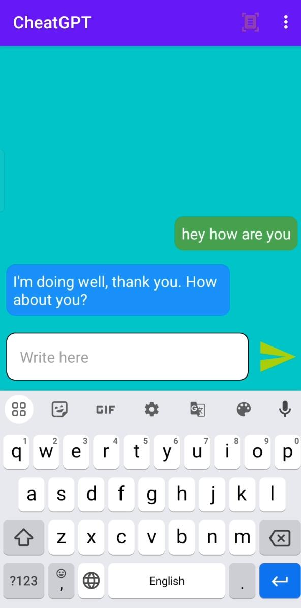
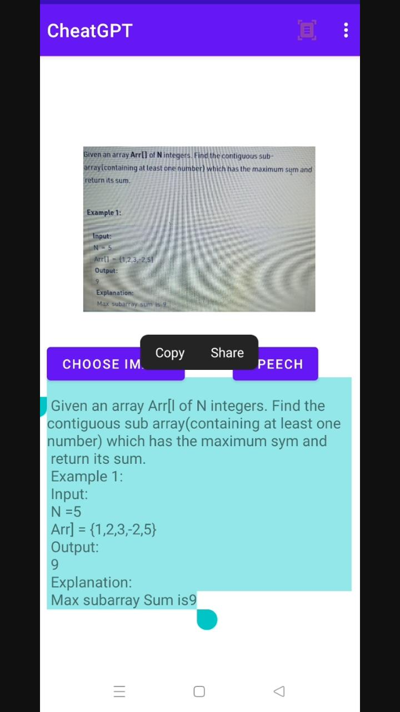

# CheatGPT Mobile Application

The CheatGPT Mobile Application is a powerful tool that combines the capabilities of OpenAI's ChatGPT API and Optical Character Recognition (OCR)
in a mobile environment. This application allows users to extract text from images or scanned documents using OCR (with MLKit) and utilize the extracted text as input to the ChatGPT API, providing quick answers and information.


## Images






## Features

- OCR Integration: The application integrates OCR functionality with MLKit, allowing for accurate text recognition from images or scanned documents.
- OpenAI ChatGPT API: CheatGPT utilizes the OpenAI ChatGPT API to provide answers and information based on the extracted text.
- Convenient Mobile Experience: The application is designed to offer a user-friendly and intuitive interface for mobile devices.
- Copy and Paste Support: Once the text is extracted using OCR, users can easily copy and paste it into the CheatGPT interface to receive responses from ChatGPT.

## Prerequisites

To use the CheatGPT Mobile Application, ensure the following:

- Mobile Device: You need a compatible mobile device (Android).
- OpenAI API Key: Obtain an API key from OpenAI to access the ChatGPT API.
- MLKit: MLKit is a mobile machine learning framework provided by Google. Ensure you have integrated MLKit into your mobile application.
To clone the CheatGPT Mobile Application repository from GitHub and start it in Android Studio, follow these steps:

1. Install Android Studio: If you haven't already, download and install the latest version of Android Studio from the official website (https://developer.android.com/studio).

2. Clone the CheatGPT Mobile Application repository: Open a terminal or command prompt and navigate to the directory where you want to clone the repository. Then, run the following command:

   ```bash
   git clone https://github.com/your-username/cheatgpt-mobile.git
   ```

   Replace `your-username` with your GitHub username.

3. Open the project in Android Studio: Launch Android Studio and select "Open an existing Android Studio project." Navigate to the directory where you cloned the CheatGPT repository, and select the project folder (`cheatgpt-mobile`). Android Studio will open the project.

4. Gradle synchronization: Once the project is opened in Android Studio, it may take a moment to synchronize and download the necessary dependencies. Android Studio will display a progress bar for this process. Ensure that your internet connection is stable.

5. Build the project: After the synchronization is complete, you can build the project by selecting "Build" -> "Make Project" from the Android Studio menu. This step will compile the code and resolve any build errors, if present.

6. Configure API keys: The CheatGPT Mobile Application requires an API key from OpenAI to access the ChatGPT API. You need to obtain an API key and add it to the project. Follow the instructions in the project's README file to configure the API key.

7. Run the application: Connect your Android device or start an emulator in Android Studio. Then, click the "Run" button in Android Studio to run the CheatGPT Mobile Application on the selected device/emulator.

   Note: Ensure that your device or emulator meets the minimum requirements specified in the project's README file.

8. Test the application: Once the application is running on your device/emulator, you can test its features, including OCR and the ChatGPT integration.

You have now successfully cloned the CheatGPT Mobile Application repository from GitHub and started it in Android Studio. You can make modifications, add features, or fix issues in the project as needed.
## Usage

1. Launch the CheatGPT application on your mobile device.

2. import an image containing the text you want to extract.

3. Utilize OCR to extract the text:

   - Tap the "OCR" button in the application interface.
   - Select the region of the image containing the text.
   - The extracted text will be displayed in the application interface.

4. Copy the extracted text.

5. Paste the extracted text into the ChatGPT interface.

6. Engage in a conversation with CheatGPT to obtain answers or information based on the extracted text.

## Configuration

The CheatGPT Mobile Application offers limited configuration options within the app. However, you can customize some aspects of the ChatGPT behavior by accessing the settings menu.

## Limitations

- OCR accuracy depends on the quality, resolution, and clarity of the input image. Images with complex layouts, handwritten text, or low resolution may result in reduced accuracy.
- ChatGPT's responses may not always be correct or accurate. Users should exercise caution and verify the information provided.
- The ChatGPT API has rate limits and associated costs. Ensure you review the OpenAI pricing and usage guidelines to understand any limitations or charges.

## Note on MLKit OCR

The CheatGPT Mobile Application integrates MLKit for OCR functionality. MLKit is a powerful tool that provides reliable and accurate text recognition capabilities. Make sure you have properly integrated MLKit into your mobile application and follow the MLKit documentation for usage instructions and best practices.

Note: This readme assumes that you have already integrated MLKit OCR into your mobile application. If not, please refer to the MLKit documentation and guides for the necessary steps to integrate MLKit OCR into your project.